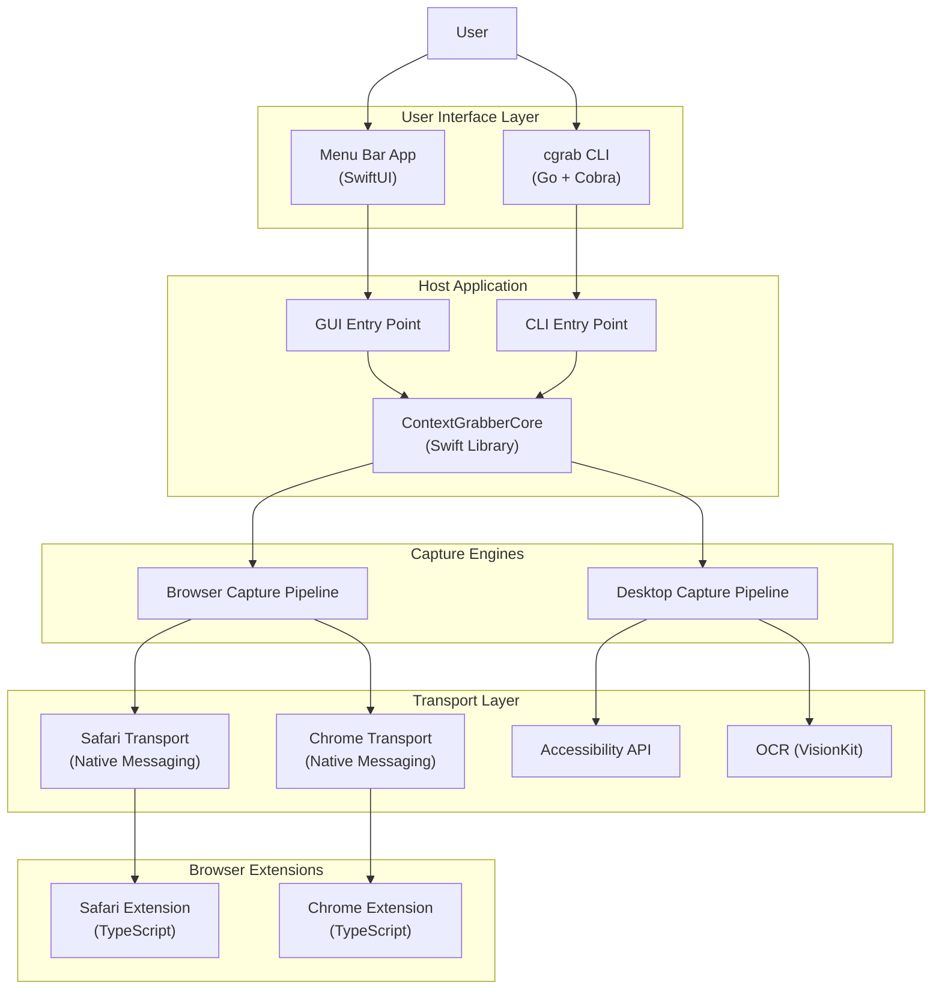
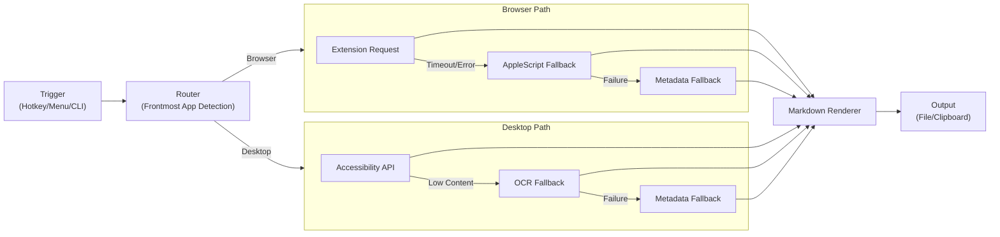
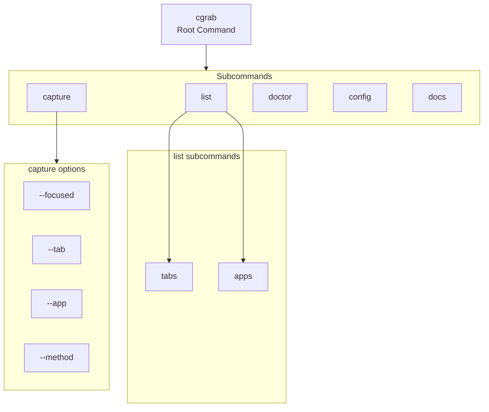

# Architecture Review

**Date:** 2026-02-15
**Scope:** Full codebase architecture assessment

## Executive Summary

Context Grabber's architecture is **well-designed** with clear separation of concerns, appropriate technology choices, and robust fallback mechanisms. The multi-language stack (Swift/Go/TypeScript) is justified by the requirements—each language is used where it provides the best capabilities for the task.

**Overall Grade:** B+

---

## System Architecture

### High-Level Component Diagram



### Capture Pipeline Flow



### Command Structure



---

## Technology Stack

| Layer | Technology | Justification |
|-------|-----------|---------------|
| **Host App** | Swift 6, SwiftUI, AppKit | Native macOS integration, Accessibility APIs, OCR via VisionKit |
| **CLI** | Go 1.21+, Cobra | Fast startup, single binary distribution, excellent CLI ergonomics |
| **Extensions** | TypeScript, Bun | Browser APIs, fast build times, native messaging support |
| **Build System** | SwiftPM, Bun Workspaces | Native package management for each ecosystem |
| **Testing** | XCTest, Go test, Bun test | Standard tooling for each language |
| **Bridge** | Native Messaging (JSON) | Browser standard, bidirectional communication |

---

## Architectural Patterns

### 1. Multi-Language Stack

Each language is used where it provides unique value:

- **Swift**: macOS system integration (Accessibility APIs, ScreenCaptureKit, Vision OCR)
- **Go**: CLI performance and developer experience (fast compilation, static binaries)
- **TypeScript**: Browser extension APIs and DOM manipulation

### 2. Dependency Injection

**Swift Example** (`DesktopCapturePipeline.swift`):
```swift
public struct DesktopCaptureDependencies {
  public let accessibilityExtractor: (pid_t?) -> String?
  public let ocrExtractor: (pid_t?) async -> OCRCaptureResult?
}
```

**Go Example** (`cmd/capture.go`):
```go
var (
  listTabsFunc       = osascript.ListTabs
  captureBrowserFunc = bridge.CaptureBrowser
  // Overridable for testing
)
```

### 3. Protocol-Based Communication

**Message Envelope Pattern** ensures type safety across language boundaries:
```typescript
interface NativeMessageEnvelope<TType extends string, TPayload> {
  id: string;
  type: TType;
  timestamp: string;
  payload: TPayload;
}
```

**Protocol Version Pinning**: Version "1" prevents breaking changes during updates.

### 4. Graceful Degradation (Fallback Chain)

**Desktop Capture Priority**:
1. Accessibility API extraction
2. OCR fallback (if content below threshold)
3. Metadata-only with warnings

**Browser Capture Priority**:
1. Extension native messaging (auto → live → runtime)
2. AppleScript fallback
3. Metadata-only with timeout/failure

### 5. Result Types with Metadata

All capture results include diagnostic information:
```swift
public struct CaptureResolution {
  public let payload: BrowserContextPayload
  public let extractionMethod: String
  public let transportStatus: String
  public let warning: String?
  public let errorCode: String?
}
```

---

## Strengths

### 1. Clean Separation of Concerns

- Host app handles macOS-specific functionality
- CLI provides ergonomic interface
- Extensions handle browser-specific extraction
- Each layer has clear responsibilities

### 2. Robust Error Handling

- Custom error types at each layer
- Consistent error wrapping with context
- Graceful degradation never leaves user without output
- Detailed diagnostics for troubleshooting

### 3. Testability

- Dependency injection at all layers
- Overridable function variables for mocking
- Protocol-based abstractions
- No heavy mocking frameworks required

### 4. Type Safety

- Strong typing across Swift, Go, and TypeScript
- Shared protocol contracts in `packages/shared-types`
- Type guards and validation at boundaries

### 5. Deterministic Output

- Same input always produces same markdown structure
- Consistent section ordering
- Predictable truncation behavior

---

## Areas for Improvement

### 1. Configuration Management

**Issue**: Two separate configuration systems:
- Swift Host App: UserDefaults via `HostSettings`
- Go CLI: JSON file at `~/.contextgrabber/config.json`
- Scattered environment variables across both

**Recommendation**: 
- Unify configuration under a single source of truth
- Document the boundary between CLI and host config clearly
- Consider a shared config schema

### 2. CLI-Host Communication Overhead

**Issue**: Go CLI spawns Swift binary for each capture operation, adding latency.

**Current Flow**:
```
Go CLI → Spawn Swift Host → Capture → JSON Response
```

**Recommendation**:
- Measure actual latency impact
- Consider long-running Swift daemon mode for frequent captures
- Document performance characteristics

### 3. Error Handling Consistency

**Issue**: Different error patterns across languages:
- Swift: Custom enums with `LocalizedError`
- Go: Wrapped standard errors
- TypeScript: Likely custom error classes

**Recommendation**:
- Define a shared error taxonomy
- Document error handling patterns
- Consider unified error codes across boundaries

### 4. Documentation Gaps

**Missing**:
- Architecture decision records (ADRs)
- Performance benchmarks
- Extension discovery documentation
- Integration test coverage documentation

### 5. Extension Discovery Complexity

**Issue**: Browser extension detection logic appears complex.

**Recommendation**:
- Simplify with manifest-based discovery
- Document the detection algorithm
- Add diagnostics for extension detection

---

## Module Breakdown

### Swift Host App (`apps/macos-host/`)

| File | Purpose |
|------|---------|
| `ContextGrabberHostApp.swift` | Main app, menu bar UI, state management |
| `CLIEntryPoint.swift` | CLI argument parsing, headless capture |
| `DesktopCapturePipeline.swift` | AX extraction, OCR fallback, permissions |
| `BrowserCapturePipeline.swift` | Browser capture resolution, fallback handling |
| `TransportLayer.swift` | Native messaging with extensions |
| `ProtocolTypes.swift` | Message envelope types |
| `HostSettings.swift` | User preferences management |
| `MarkdownRendering.swift` | Markdown output generation |

### Go CLI (`cgrab/`)

| Package | Purpose |
|---------|---------|
| `cmd/` | Cobra commands (list, capture, doctor, config, docs) |
| `internal/bridge/` | Swift host communication, browser detection |
| `internal/config/` | Settings management (JSON-based) |
| `internal/osascript/` | AppleScript execution for tabs/apps |
| `internal/output/` | File writing, clipboard operations |

### TypeScript Extensions (`packages/`)

| Package | Purpose |
|---------|---------|
| `extension-safari/` | Safari extension runtime |
| `extension-chrome/` | Chrome extension runtime |
| `extension-shared/` | Shared extraction, sanitization, transport |
| `shared-types/` | Protocol contracts, type guards |
| `native-host-bridge/` | Native messaging bridge |

---

## Data Flow Examples

### Browser Capture (Success Path)

```
User presses ⌃⌥⌘C
    ↓
Host app detects frontmost app is Safari
    ↓
Send capture request via SafariNativeMessagingTransport
    ↓
Spawn bun cli.ts (native-host-bridge)
    ↓
Send message to Safari extension via native messaging
    ↓
Extension extracts DOM content, page metadata
    ↓
Return payload through bridge to Swift host
    ↓
Render markdown with BrowserCapturePipeline
    ↓
Write to file + copy to clipboard
```

### Desktop Capture (OCR Fallback)

```
User presses ⌃⌥⌘C in Xcode
    ↓
Host app detects frontmost app is not browser
    ↓
Attempt Accessibility API extraction
    ↓
AX returns minimal text (below threshold)
    ↓
Trigger OCR fallback via ScreenCaptureKit + Vision
    ↓
OCR extracts text from screen content
    ↓
Render markdown with DesktopCapturePipeline
    ↓
Include warning about OCR fallback in output
    ↓
Write to file + copy to clipboard
```

### CLI Capture

```
User runs: cgrab capture --app "Xcode"
    ↓
Go CLI parses arguments with Cobra
    ↓
Determine capture target (browser vs desktop)
    ↓
Spawn Swift host with CLI flags: --capture --app "Xcode"
    ↓
CLIEntryPoint parses Swift arguments
    ↓
Execute DesktopCapturePipeline
    ↓
Return JSON result to Go CLI
    ↓
Go CLI handles output (file/clipboard per global flags)
```

---

## Testing Strategy

### Unit Testing

**Swift**: XCTest with dependency injection
- Mock `accessibilityExtractor` and `ocrExtractor`
- Test pipeline logic without system dependencies

**Go**: Table-driven tests with function overrides
```go
listTabsFunc = func(ctx context.Context, browser string) ([]TabEntry, []string, error) {
  return mockTabs, nil, nil
}
```

**TypeScript**: Bun test runner with mock browser APIs

### Integration Testing

- End-to-end capture pipeline tests
- Native messaging bridge tests
- Extension loading and communication tests

### Testing Gaps

- Performance benchmarks missing
- Load testing not documented
- Cross-language integration tests limited

---

## Security Considerations

### Local-First Design
- All processing on-device
- No cloud dependencies in capture pipeline
- User data never leaves the system

### Permission Model
- Accessibility API access (required for desktop capture)
- Screen recording (required for OCR)
- Browser extension permissions (page content, tabs)

### Data Sanitization
- Extension-side sanitization in `extension-shared`
- No sensitive data in logs
- Configurable retention policies

---

## Performance Characteristics

### Known Bottlenecks

1. **Go → Swift Spawn**: ~50-100ms per capture (estimated)
2. **Browser Extension Startup**: First capture slower due to bridge initialization
3. **OCR Processing**: Depends on screen area, typically 100-500ms

### Optimization Opportunities

1. **Swift Daemon Mode**: Keep host process alive for CLI calls
2. **Extension Preloading**: Warm up extension connections
3. **OCR Region Optimization**: Capture only focused window

---

## Recommendations

### High Priority

1. **Unify Configuration**: Single config system across CLI and host
2. **Document Performance**: Add benchmarks for capture latency
3. **Error Taxonomy**: Define shared error codes

### Medium Priority

1. **Architecture Diagrams**: Add to README (Mermaid renders on GitHub)
2. **Extension Discovery**: Simplify detection logic
3. **Testing**: Add cross-language integration tests

### Low Priority

1. **Swift Daemon**: Only if latency becomes an issue
2. **Telemetry**: Optional capture metrics (opt-in)
3. **Plugin System**: Allow custom capture handlers

---

## Conclusion

Context Grabber demonstrates solid architectural decisions:

- **Appropriate technology choices** for each layer
- **Clear separation of concerns** between components
- **Robust fallback mechanisms** ensure reliability
- **Testable design** with dependency injection
- **Type safety** across language boundaries

The main areas for improvement are configuration management and documentation. The multi-language complexity is well-justified by the feature requirements and would be difficult to achieve with a single language.

**Overall Assessment**: Production-ready architecture with room for polish.

---

## References

- [Architecture Overview](./overview.md)
- [Capture Pipeline](./capture-pipeline.md)
- [Repository Map](./repository-map.md)
- [CLI Component](../components/companion-cli.md)
- [macOS Host](../components/macos-host.md)
