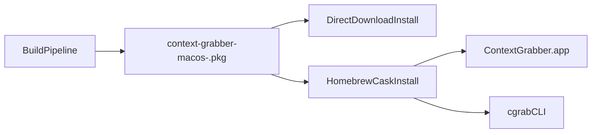

# Distribution and Packaging Plan

## Goal

Ship a **single downloadable package** that installs both:
- the macOS app (`ContextGrabber.app`)
- the CLI (`cgrab`)

Use one canonical release artifact and multiple distribution channels that point to the same asset.

## Recommended Approach

1. Canonical artifact: `context-grabber-macos-<version>.pkg`
2. Primary distribution channel: Homebrew Cask
3. Delivery maturity: start unsigned/local dogfood, then add signing + notarization
4. npm/bun: optional later wrapper (not primary for app distribution)

## Why This Approach

- Homebrew Cask is the cleanest macOS install UX for GUI + CLI together.
- A `.pkg` installer handles privileged install paths cleanly.
- One canonical artifact avoids drift between channels.
- npm/bun is better as a convenience wrapper than as the primary macOS app installer.

## Install Contract

Target installation layout:
- `/Applications/ContextGrabber.app`
- `/usr/local/bin/cgrab` — **standalone binary** (not a symlink into the .app bundle)

Decisions finalized:
- **CLI packaging style**: standalone Go binary installed directly to `/usr/local/bin/`. The Go binary resolves the host at `/Applications/ContextGrabber.app/Contents/MacOS/ContextGrabberHost` as a fallback. No symlink means no breakage if the app is relocated.
- **Version strategy**: semantic versioning starting at `0.1.0`. Single `VERSION` file at repo root consumed by both Swift and Go build scripts. Go CLI injects via `-ldflags`, Swift app via `Info.plist` during staging.
- **Pkg identifiers**: `com.contextgrabber.pkg` (product), `com.contextgrabber.app` (app component), `com.contextgrabber.cli` (CLI component).

Desktop capture path must preserve the single-binary permission model:
- CLI desktop capture routes to `ContextGrabberHost --capture ...`
- keep binary-path behavior stable so Accessibility/Screen Recording grants remain predictable.

Detailed implementation plan: `docs/plans/distribution-packaging-implementation.md`.

## Distribution Flow

## Implementation Phases

### Phase 1: Define Packaging Contract ✓
- Finalized app/CLI install paths and versioning strategy.
- `cgrab` installed as a standalone binary.
- `VERSION` file at repo root as single source of truth.

### Phase 2: Add Packaging Scripts ✓
- Added `scripts/release/stage-macos-artifacts.sh`
- Added `scripts/release/build-macos-package.sh`
- Added `packaging/macos/` assets (distribution.xml, postinstall, welcome.html).

### Phase 3: Dogfood Installer ✓
- Built unsigned local `.pkg` (5.7MB).
- Validated:
  - Two-component package (app + CLI) with correct payloads
  - CLI version injection: `cgrab --version` prints `0.1.0`
  - Info.plist: version, bundle ID, LSUIElement all correct
  - App binary: Mach-O arm64 executable
  - Resource bundle included
  - postinstall script included
- Known: `com.apple.provenance` xattrs on macOS 15+ produce cosmetic `._*` files in payload (does not affect install).

### Phase 4: Homebrew Cask ✓
- Created tap repo: `anthonylu23/homebrew-context-grabber`
- Cask formula: `Casks/context-grabber.rb` pointing to GitHub Release asset
- GitHub Release `v0.1.0` with `.pkg` artifact uploaded
- `brew style` and `brew audit` pass with zero offenses
- Install: `brew tap anthonylu23/context-grabber && brew install --cask context-grabber`
- Uninstall: `brew uninstall --cask context-grabber`

### Phase 5: Release Automation ✓
- Tag-triggered GitHub Actions workflow (`.github/workflows/release.yml`)
- Validates tag matches `VERSION` file, builds `.pkg`, runs smoke tests
- Smoke tests: package payload structure, CLI version injection, Info.plist fields, binary architecture, postinstall user/home resolution
- Creates GitHub Release with `.pkg` asset, install instructions, and SHA256 checksum
- Manual step after release: update Homebrew cask SHA256 in tap repo

### Phase 6: Signing + Notarization
- Add Developer ID signing + notarization pipeline.
- Gate production/public links on notarized artifacts.
- Investigate provenance-related AppleDouble (`._*`) payload noise reduction on newer macOS versions.

## Optional Later: npm/bun Wrapper

Potential later addition:
- Publish a thin npm/bun package that downloads and installs the same `.pkg` artifact.
- Keep it secondary to Brew/direct download to avoid duplicate release logic.

## Exit Criteria

- One canonical release asset installs both app + CLI.
- Brew install path works end to end from the same asset.
- Installer flow is documented and reproducible.
- Signing/notarization path is defined (and implemented before broader public rollout).
