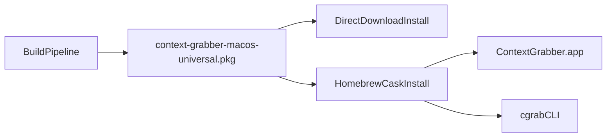

# Distribution and Packaging Plan

## Goal

Ship a **single downloadable package** that installs both:
- the macOS app (`ContextGrabber.app`)
- the CLI (`cgrab`)

Use one canonical release artifact and multiple distribution channels that point to the same asset.

## Recommended Approach

1. Canonical artifact: `context-grabber-macos-universal.pkg`
2. Primary distribution channel: Homebrew Cask
3. Delivery maturity: start unsigned/local dogfood, then add signing + notarization
4. npm/bun: optional later wrapper (not primary for app distribution)

## Why This Approach

- Homebrew Cask is the cleanest macOS install UX for GUI + CLI together.
- A `.pkg` installer handles privileged install paths cleanly.
- One canonical artifact avoids drift between channels.
- npm/bun is better as a convenience wrapper than as the primary macOS app installer.

## Install Contract

Target installation layout:
- `/Applications/ContextGrabber.app`
- `/usr/local/bin/cgrab` (or architecture-appropriate symlink/shim)

Desktop capture path must preserve the single-binary permission model:
- CLI desktop capture routes to `ContextGrabberHost --capture ...`
- keep binary-path behavior stable so Accessibility/Screen Recording grants remain predictable.

## Distribution Flow

## Implementation Phases

### Phase 1: Define Packaging Contract
- Finalize app/CLI install paths and versioning strategy.
- Decide whether `cgrab` is installed as a standalone binary or shim.

### Phase 2: Add Packaging Scripts
- Add `scripts/release/stage-macos-artifacts.sh`
- Add `scripts/release/build-macos-package.sh`
- Add `packaging/macos/` assets (pkg metadata/templates/scripts).

### Phase 3: Dogfood Installer
- Build unsigned local `.pkg`.
- Validate:
  - app launch works
  - `cgrab --version` works
  - `cgrab doctor` works
  - desktop capture via `ContextGrabberHost --capture` works

### Phase 4: Homebrew Cask
- Add/update cask manifest in tap repo.
- Point cask to the canonical `.pkg` artifact.
- Validate install/uninstall behavior.

### Phase 5: Release Automation + Docs
- Add CI checks for package contents and smoke tests.
- Update:
  - `README.md`
  - `docs/codebase/components/companion-cli.md`
  - `docs/codebase/usage/local-dev.md`
  - `docs/plans/context-grabber-project-plan.md`

### Phase 6: Signing + Notarization
- Add Developer ID signing + notarization pipeline.
- Gate production/public links on notarized artifacts.

## Optional Later: npm/bun Wrapper

Potential later addition:
- Publish a thin npm/bun package that downloads and installs the same `.pkg` artifact.
- Keep it secondary to Brew/direct download to avoid duplicate release logic.

## Exit Criteria

- One canonical release asset installs both app + CLI.
- Brew install path works end to end from the same asset.
- Installer flow is documented and reproducible.
- Signing/notarization path is defined (and implemented before broader public rollout).
